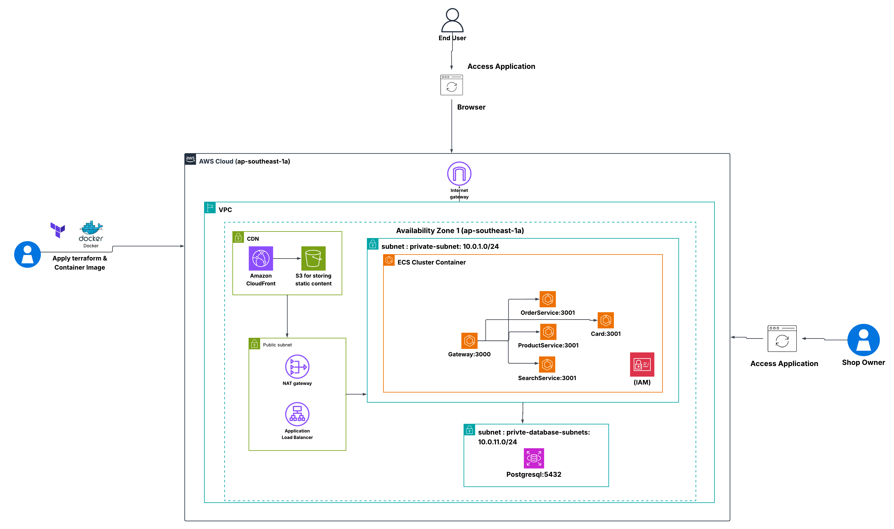

# Flora Tailor 🌸


Flora Tailor เป็นระบบ E-Commerce แบบ Microservices ประกอบด้วย Frontend (React) และ Backend Services (NestJS/Bun) จำนวน 5 ตัว ได้แก่ Gateway, Inventory, Cart, Order, และ Payment ทำงานร่วมกับ PostgreSQL บนโครงสร้างพื้นฐาน AWS

---

## 💻 การติดตั้งและรันบนเครื่อง Local (Local Development)

การรันโปรเจกต์นี้บนเครื่องของคุณเอง (สำหรับการพัฒนา)

### สิ่งที่ต้องมีเบื้องต้น (Prerequisites)

- [Node.js](https://nodejs.org/) (สำหรับรัน React ขา Frontend)
- [Bun](https://bun.sh/) (สำหรับรันเซิร์ฟเวอร์ Backend)
- [Docker & Docker Compose](https://www.docker.com/) (สำหรับจำลองฐานข้อมูล PostgreSQL บนเครื่อง)

### ขั้นตอนการรัน

1. **เปิด Database ทิ้งไว้:**
   เข้าไปที่โฟลเดอร์รัน Docker Compose เพื่อเปิดฐานข้อมูลจำลอง (ถ้าคุณตั้งค่า `docker-compose.yml` ไว้)

   ```bash
   docker-compose up -d
   ```

2. **ติดตั้ง Dependencies และรัน Backend ทั้ง 5 ตัว:**
   คุณต้องเปิด Terminal 5 หน้าต่าง เพื่อรันแต่ละ Service:

   ```bash
   # เปิด Terminal 1
   cd backend/gateway && bun install && bun run start:dev

   # เปิด Terminal 2
   cd backend/inventory-service && bun install && bun run start:dev

   # เปิด Terminal 3
   cd backend/cart-service && bun install && bun run start:dev

   # เปิด Terminal 4
   cd backend/order-service && bun install && bun run start:dev

   # เปิด Terminal 5
   cd backend/payment-service && bun install && bun run start:dev
   ```

3. **ติดตั้ง Dependencies และรัน Frontend:**
   เปิด Terminal หน้าต่างที่ 6:

   ```bash
   cd frontend
   npm install
   npm run dev
   ```

   จากนั้นเข้าดูเว็บไซต์ได้ที่ `http://localhost:5173` (หรือพอร์ตที่ React/Vite กำหนด)

4. **การจำลองข้อมูลเริ่มต้น (Seeding):**
   หากต้องการใส่ข้อมูลจำลองลงในฐานข้อมูล (รองรับการรันซ้ำแบบไม่สร้างข้อมูลซ้ำ)
   ```bash
   npm run seed:init
   ```

   ถ้า Gateway ไม่ได้รันที่ `http://localhost:3000` สามารถกำหนดปลายทางได้:
   ```bash
   API_BASE=http://localhost:3000 npm run seed:init
   ```

---

## 🚀 การนำระบบขึ้น AWS ครั้งแรก (Initial Deployment)

เนื่องจากระบบ ECS (เซิร์ฟเวอร์จำลอง) ของ AWS จำเป็นต้องคอยดึง Docker Image จาก ECR (โกดังเก็บรูปภาพ) **ในครั้งแรกสุดที่คุณ Deploy คุณจะไม่สามารถรัน `terraform apply` รวดเดียวจบได้** เพราะ ECS จะหา Image ไม่เจอ (ไก่กับไข่)

เราจึงต้องทำตามสเต็ป "สร้างโกดัง -> เอาของใส่โกดัง -> สร้างเซิร์ฟเวอร์" ตามลำดับดังนี้:

### Step 1: สร้างโกดัง ECR ด้วย Terraform ก่อน

ไปที่โฟลเดอร์ของ Terraform และสั่งสร้าง **เฉพาะส่วน ECR** ก่อน:

```bash
cd terraform/environments/prod
terraform init
terraform apply -target="module.ecr"
```

_(กดยืนยัน `yes` เพื่อสร้าง ECR Repositories ทั้ง 5 ตัว)_

### Step 2: รัน Shell Script หรือคำสั่งเพื่อ Push Initial Image (ก่อนรัน Terraform ส่วนที่เหลือ)

เมื่อได้โกดัง (ECR) แล้ว ให้เราล็อกอินและยัด Image เปล่าๆ หรือ Image รอบแรกสุดขึ้นไปบน AWS:

```bash
# 1. ล็อกอินเข้า AWS ECR
aws ecr get-login-password --region ap-southeast-1 | docker login --username AWS --password-stdin <AWS_ACCOUNT_ID>.dkr.ecr.ap-southeast-1.amazonaws.com

# 2. ทำการ Build และ Push ทั้ง 5 Services
# (ตั้งตัวแปร ECR_BASE เป็น URL โกดังของคุณ เช่น 123456789.dkr.ecr.ap-southeast-1.amazonaws.com)
docker build -t $ECR_BASE/floratailor/gateway:latest ./backend/gateway
docker push $ECR_BASE/floratailor/gateway:latest

docker build -t $ECR_BASE/floratailor/inventory-service:latest ./backend/inventory-service
docker push $ECR_BASE/floratailor/inventory-service:latest

docker build -t $ECR_BASE/floratailor/cart-service:latest ./backend/cart-service
docker push $ECR_BASE/floratailor/cart-service:latest

docker build -t $ECR_BASE/floratailor/order-service:latest ./backend/order-service
docker push $ECR_BASE/floratailor/order-service:latest

docker build -t $ECR_BASE/floratailor/payment-service:latest ./backend/payment-service
docker push $ECR_BASE/floratailor/payment-service:latest
```

### Step 3: รัน Terraform เพื่อสร้างส่วนที่เหลือทั้งหมด

เมื่อใน ECR มี Image แล้ว ECS ก็จะสามารถบูตตัวเองขึ้นมาได้สำเร็จ สั่งสร้างส่วนอื่นๆ (VPC, RDS, ECS, CloudFront, ฯลฯ) ต่อได้เลย:

```bash
cd terraform/environments/prod
terraform apply
```

_(กดยืนยัน `yes` รอบนี้ Terraform จะสร้างทุกอย่างให้เสร็จสมบูรณ์)_

---

## ⚡ การอัปเดตระบบในชีวิตประจำวัน (Ongoing Deployments)

หลังจากที่คุณผ่านการ Deploy ครั้งแรกสุด (Initial Deployment) ไปแล้ว ชีวิตของคุณจะง่ายขึ้นมาก!

ทุกครั้งที่คุณเขียนโค้ดแก้บั๊ก หรือเพิ่มฟีเจอร์ใหม่ ไม่ว่าจะเป็นหน้าบ้าน (Frontend) หรือหลังบ้าน (Backend) คุณไม่ต้องไปแตะ Terraform อีกเลย **คุณแค่รันสคริปต์ตัวเดียวจบ!**

### สำหรับผู้ใช้ Windows:

```powershell
./scripts/deploy.ps1
```

### สำหรับผู้ใช้ Mac/Linux:

```bash
./scripts/deploy.sh
```

**สคริปต์นี้จะทำหน้าที่:**

1. ดึงข้อมูลจากโดเมน Terraform ล่าสุด
2. บิลด์ (Build) และอัปโหลด (Push) โค้ด Backend สดใหม่ขึ้น ECR
3. สั่งปลุก (Restart/Update) ตัว ECS บนเว็บ AWS ให้ไปดึงโค้ดใหม่มาใช้
4. บิลด์ (Build) โค้ดฝั่ง React (Frontend)
5. จับโยนขึ้น S3 Bucket อัตโนมัติ
6. ล้างแคช (Invalidate) ใน CloudFront เพื่อให้ผู้ใช้หน้าเว็บเห็นอัปเดตทันที
   _(ชงกาแฟเสร็จ กลับมาเว็บก็อัปเดตเรียบร้อยครับ!)_
